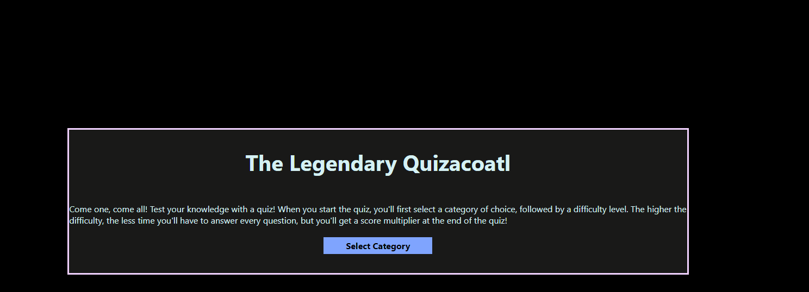

# Code-Quiz

A simple quiz where the user must answer a set of questions during an allotted time. The time remaining becomes the user's score, and the score is logged and retrieved from local storage.

## Criteria

* We want to present the user with a start button to start the quiz
* When the start button is pressed, a timer is initiated and begins counting down.
* When the timer starts, a question is presented to the user
* The user may select from multiple options to answer a question
  * When the user answers the question correctly, they are presented with another question
  * When the user answers the question incorrectly, they a penalized with a deduction in time from the timer
* The quiz ends when the user has answered all questions or their timer reaches 0
* When the quiz is over, the user may enter their initials and submit a score to be saved

## Bonus Features

* A toggle for a dark/light theme to be applied to quiz
  * 
* The quiz has multiple categories that the user may select before starting the quiz
  * 
* Dynamic high score list that can be viewed at any time during quiz
* Some questions will show an image that appears dynamically
* A message appears temporarily to notify the user if they answered correctly or incorrectly

## Notes
There were many more features that were meant to be added, however due to time constraints these features were removed. Most the code has been added to the unused.js file for future reference and possibly their eventual addition at a future time.
### Future Features
* Timer design to be per question instead of total time
* Difficulty mode
  * Each difficulty would change the amount of time given per question
  * Score multiplier to award more points for harder difficulty
* Larger pool of questions, so that each quiz is randomly generated and different each time
  * Answers to be randomly sorted so that their options aren't the same each time
